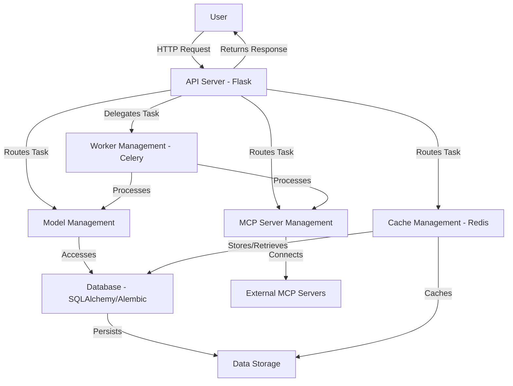

# Architecture of Zi Coder Agent

## System Design
Zi Coder Agent is engineered with a modular, microservices-oriented architecture to ensure scalability, maintainability, and flexibility. This design enables independent development, testing, and deployment of individual components while facilitating seamless integration to deliver AI-driven coding assistance.

## Component Relationships
- **API Server**: Built with Flask, this serves as the central interface for user interactions, handling HTTP requests, and providing access to the Swagger UI for API documentation and testing. It routes user requests to appropriate backend services.
- **Database**: Utilizes SQLAlchemy as an ORM layer and Alembic for migrations, managing persistent storage for configurations, AI model metadata, user data, and task history. It supports SQLite for development and PostgreSQL for production environments.
- **Model Management**: Manages the lifecycle of AI models, including loading, unloading, and updating models for code generation and analysis. This component ensures the right model is available for specific tasks based on user requirements or project context.
- **MCP Server Management**: Coordinates connections to Model Context Protocol (MCP) servers, enabling extended capabilities such as accessing external tools and resources. It handles communication protocols and ensures secure integration with third-party services.
- **Cache Management**: Leverages Redis to cache frequently accessed data like model outputs, API responses, and user session information, significantly improving response times and reducing computational overhead.
- **Worker Management**: Employs Celery for distributed task processing, managing background tasks such as long-running AI computations or batch operations. Workers operate asynchronously, ensuring the API remains responsive during intensive tasks.

## Data Flow
- **User Request**: A user interacts with the API Server through HTTP requests, initiating tasks like code generation or debugging.
- **Task Dispatch**: The API Server routes the task to the appropriate component, such as Model Management for AI processing, often delegating intensive tasks to Workers via Celery.
- **Data Access**: Components interact with the Database for persistent storage or retrieve cached data from Redis to optimize performance.
- **External Integration**: MCP Server Management facilitates connections to external services or tools as needed, expanding the agent's capabilities.
- **Response**: Results are processed, cached if necessary, and returned to the user via the API Server, often with detailed feedback or generated code.

## Dependencies
- **Core Framework**: The system relies on Python 3.9+ for core functionality, with dependencies managed via `pyproject.toml` and installed through `uv` or `pip` as detailed in `requirements.txt`.
- **Web Serving**: Flask provides the web framework for the API Server, with `flask-swagger-ui` integrating interactive API documentation.
- **Database Management**: SQLAlchemy handles ORM operations, while Alembic manages schema migrations, and `pymysql` supports MySQL connections if needed.
- **Task Queue and Caching**: Celery orchestrates asynchronous task execution, and Redis serves as an in-memory store for caching and message brokering.
- **Development Tools**: Development dependencies include `pytest` for testing, `black` and `isort` for code formatting, and `pylint` and `flake8` for linting, ensuring code quality.

## Architectural Diagram
Below is a simplified representation of the system architecture using Mermaid for visualization:

## Design Principles
- **Modularity**: Each component is designed to be independent, allowing for updates or replacements without affecting the entire system.
- **Scalability**: Horizontal scaling is supported through distributed workers and caching mechanisms to handle increased load.
- **Extensibility**: The MCP integration allows for plugging in new tools and services, ensuring the system can evolve with technological advancements.
- **Performance**: Asynchronous processing and caching are prioritized to minimize latency in user interactions.
- **Maintainability**: Clear separation of concerns and comprehensive documentation facilitate ongoing maintenance and onboarding of new developers.

*Note: This document will be further expanded with detailed sequence diagrams, additional component interactions, and specific dependency mappings as the project progresses.*
